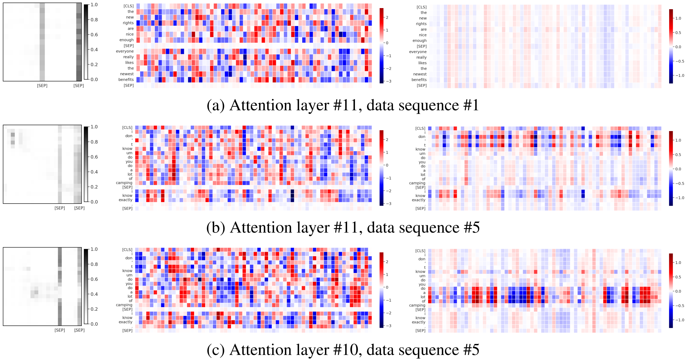

# Outlier-free Transformers
This repository contains the implementation and LLM experiments for the paper presented in

**Yelysei Bondarenko<sup>1</sup>, Markus Nagel<sup>1</sup>, Tijmen Blankevoort<sup>1</sup>, 
"Quantizable Transformers: Removing Outliers by Helping Attention Heads Do Nothing", NeurIPS 2023.** [[ArXiv]](https://arxiv.org/abs/2306.12929)

<sup>1</sup> Qualcomm AI Research (Qualcomm AI Research is an initiative of Qualcomm Technologies, Inc.)


## Reference
If you find our work useful, please cite
```
@article{bondarenko2023quantizable,
  title={Quantizable Transformers: Removing Outliers by Helping Attention Heads Do Nothing},
  author={Bondarenko, Yelysei and Nagel, Markus and Blankevoort, Tijmen},
  journal={arXiv preprint arXiv:2306.12929},
  year={2023}
}
```

## Abstract
<p align="center">
    
</p>

Many studies have shown that modern transformer models tend to learn strong outliers in their activations, 
making them difficult to quantize. We show that strong outliers are related to very specific behavior of attention 
heads that try to learn a _"no-op"_ or just a _partial update_ of the residual. To achieve the exact zeros needed in the 
attention matrix for a no-update, the input to the softmax is pushed to be larger and larger during training, causing 
outliers in other parts of the network. 

Based on these observations, we propose two simple (independent) modifications to the attention mechanism - 
**clipped softmax** and **gated attention**. We empirically show that models pre-trained using our methods learn 
significantly smaller outliers while maintaining and sometimes even improving the floating-point task performance. 
This enables us to quantize transformers to full INT8 quantization without any additional effort.


## Repository structure
```bash
.
├── accelerate_configs  # HuggingFace accelerate configs
├── docker  # dockerfile and requirements files
├── img
├── model_configs  # YAML configs for different model sizes
├── quantization  # quantization tools and functionality
│   └── quantizers
├── scripts  # preset scripts for pre-training
└── transformers_language  # source code for quantized LLMs and our methods
    └── models
└── run_clm.py  # train a Causal Language Model (e.g., OPT)
└── run_mlm.py  # train a Masked Language Model (e.g., BERT)
└── validate_clm.py  # validate a Causal Language Model (e.g., OPT)
└── validate_mlm.py  # validate a Masked Language Model (e.g., BERT)
```

## How to install
### using docker (recommended)
You can build and run the docker container as follows
```bash
docker build -f docker/Dockerfile --tag outlier_free_transformers:latest .
docker run -ti outlier_free_transformers:latest
```


### without docker
Set locale variables and add the project root directory to your pythonpath:
```bash
export LC_ALL=C.UTF-8
export LANG=C.UTF-8
export PYTHONPATH=${PYTHONPATH}:$(realpath "$PWD")
```

Make sure to have Python ≥3.6 (tested with Python 3.8.10) and 
ensure the latest version of `pip` (**tested** with 23.2.1):
```bash
pip install --upgrade --no-deps pip
``` 

Next, install PyTorch 1.11 with the appropriate CUDA version (tested with CUDA 11.3, CuDNN 8.2.0):
```bash
pip install torch==1.11.0 torchvision==0.12.0
```

Install the remaining dependencies using pip:
```bash
pip install -r docker/requirements.txt
```

Finally, make all scripts executable
```bash
chmod +x scripts/*.sh
```

## Pre-training commands
All the training scripts (batch size, etc.) are set up to fit on a single A100 80GB GPU.

| Model     | Softmax         | Script                                                               |
|:----------|:----------------|:---------------------------------------------------------------------|
| BERT-base | vanilla         | [scripts/bert_base_vanilla.sh](scripts/bert_base_vanilla.sh)         |
| BERT-base | clipped softmax | [scripts/bert_base_clipped_softmax.sh](scripts/bert_base_clipped_softmax.sh) |
| BERT-base | gated attention | [scripts/bert_base_gated_attention.sh](scripts/bert_base_gated_attention.sh) |
| OPT-125m  | vanilla         | [scripts/opt_125m_vanilla.sh](scripts/opt_125m_vanilla.sh)                   |
| OPT-125m  | clipped softmax | [scripts/opt_125m_clipped_softmax.sh](scripts/opt_125m_clipped_softmax.sh)   |
| OPT-125m  | gated attention | [scripts/opt_125m_gated_attention.sh](scripts/opt_125m_gated_attention.sh)   |
| OPT-350m  | vanilla         | [scripts/opt_350m_vanilla.sh](scripts/opt_350m_vanilla.sh)                   |
| OPT-350m  | gated attention | [scripts/opt_350m_gated_attention.sh](scripts/opt_350m_gated_attention.sh)   |
| OPT-1.3B  | vanilla         | [scripts/opt_1.3b_vanilla.sh](scripts/opt_1.3b_vanilla.sh)                   |
| OPT-1.3B  | gated attention | [scripts/opt_1.3b_gated_attention.sh](scripts/opt_1.3b_gated_attention.sh)   |

## Validation commands
After the model is trained, you can run evaluation (both floating point, and quantized) using 
the following commands.
Make sure to pass the same softmax method arguments that were used for pre-training (e.g., `--attn_softmax vanilla`, `--attn_softmax "clipped(-.025:1)"`, `--alpha 12`, `--attn_gate_type conditional_per_token --attn_gate_mlp`, `--attn_gate_type conditional_per_token --attn_gate_init 0.25` etc.)

### FP validation for BERT models
Run command:
```bash
accelerate launch validate_mlm.py \
--seed 1000 \
--dataset_setup bookcorpus_and_wiki \
--preprocessing_num_workers 8 \
--model_type bert \
--max_seq_length 128 \
--mlm_probability 0.15 \
--per_device_eval_batch_size 32 \
--data_cache_dir ~/.hf_data \
--model_cache_dir ~/.hf_cache \
--model_name_or_path /path/to/saved/checkpoint \
--output_dir output_metrics
```
Expected (example) output:
```
INFO - validate_mlm - perplexity: 4.5438
INFO - validate_mlm - max FFN output inf norm: 20.8
INFO - validate_mlm - max FFN input + output inf norm: 47.0
INFO - validate_mlm - max LN(FFN i + o) inf norm: 25.9
INFO - validate_mlm - Avg Kurtosis: 72.19
INFO - validate_mlm - Max Kurtosis: 197.6
```


### INT8 validation for BERT models
Run command:
```bash
accelerate launch validate_mlm.py \
--quantize \
--est_num_batches 16 \
--seed 2000 \
--dataset_setup bookcorpus_and_wiki \
--preprocessing_num_workers 8 \
--model_type bert \
--max_seq_length 128 \
--mlm_probability 0.15 \
--per_device_eval_batch_size 32 \
--data_cache_dir ~/.hf_data \
--model_cache_dir ~/.hf_cache \
--model_name_or_path /path/to/saved/checkpoint \
--output_dir output_metrics
```
Expected (example) output:
```
INFO - validate_mlm - perplexity: 4.6550
INFO - validate_mlm - max FFN output inf norm: 20.6
INFO - validate_mlm - max FFN input + output inf norm: 47.0
INFO - validate_mlm - max LN(FFN i + o) inf norm: 25.7
INFO - validate_mlm - Avg Kurtosis: 70.32
INFO - validate_mlm - Max Kurtosis: 188.4
```

### FP validation for OPT models
Run command:
```bash
accelerate launch validate_clm.py \
--seed 1000 \
--dataset_setup bookcorpus_and_wiki \
--preprocessing_num_workers 4 \
--model_type opt \
--block_size 512 \
--per_device_eval_batch_size 4 \
--data_cache_dir ~/.hf_data \
--model_cache_dir ~/.hf_cache \
--model_name_or_path /path/to/saved/checkpoint \
--output_dir output_metrics
```
Expected (example) output:
```bash
INFO - validate_clm - perplexity: 15.5449
INFO - validate_clm - Max inf norm: 122.4
INFO - validate_clm - Max FFN inf norm: 0.5
INFO - validate_clm - Max layer inf norm: 9.1
INFO - validate_clm - Avg Kurtosis: 18.26
INFO - validate_clm - Max Kurtosis: 151.5
INFO - validate_clm - Max Kurtosis layers: 151.5
INFO - validate_clm -
# (...)
# detailed per-layer stats
```

### INT8 validation for OPT models
Run command:
```bash
accelerate launch validate_clm.py \
--quantize \
--quant_setup fp32_head \
--ranges_acts running_minmax \
--qmethod_acts asymmetric_uniform \
--percentile 99.999 \
--est_num_batches 4 \
--seed 2000 \
--dataset_setup bookcorpus_and_wiki \
--preprocessing_num_workers 4 \
--model_type opt \
--block_size 512 \
--per_device_eval_batch_size 1 \
--data_cache_dir ~/.hf_data \
--model_cache_dir ~/.hf_cache \
--model_name_or_path /path/to/saved/checkpoint \
--output_dir output_metrics
```
Expected (example) output:
```
perplexity: 16.0132
```
